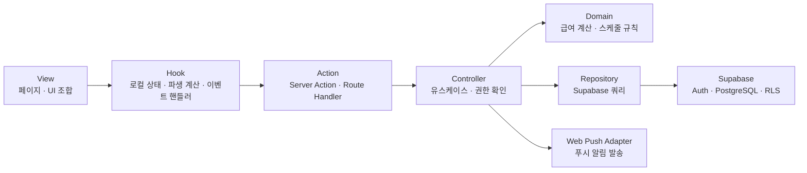

# 라비에벨 아키텍처

## 기술 구성

- Next.js App Router + React 19 + TypeScript
- vanilla-extract
- Zod 폼 입력 검증
- Supabase Auth, PostgreSQL, Row Level Security(RLS)
- Web Push API (VAPID)

## VAC 구조

기능 단위로 View, Action, Controller를 함께 배치한다. View는 데이터를 직접 변경하지 않고 Action을 호출하며, Action은 Controller에 요청을 위임한다.



로컬 상태나 파생 계산이 없는 단순한 View는 Hook 없이 Action을 직접 호출해도 된다.

### 계층 책임

| 계층 | 책임 | 금지 사항 |
| --- | --- | --- |
| View | 화면 표시, 레이아웃, 입력 마크업 | Supabase 쓰기 호출, 업무 규칙 구현 |
| Hook | View의 로컬 상태, 파생 계산, 이벤트 핸들러, 브라우저 전용 API 접근 | Supabase 쓰기 직접 호출, 업무 규칙 판단 |
| Action | 입력 수신, 스키마 검증, Controller 호출, 화면 갱신 | DB 쿼리와 업무 규칙 혼합 |
| Controller | 유스케이스 조합, 역할 확인, 업무 규칙 실행 | 폼 형식 검증, UI 상태와 SQL 세부 구현 |
| Domain | 급여 계산, 마감·배정 규칙 같은 순수 로직 | 외부 API, DB 접근 |
| Repository | Supabase 데이터 조회·저장 | 권한 정책과 업무 규칙 판단 |
| Adapter | Web Push 등 외부 API 연동 | 도메인 규칙 판단 |

## 폴더 구조

```text
app/
├─ (auth)/                 # 로그인 · 회원가입
├─ (worker)/               # 알바 전용 화면
├─ (admin)/admin/          # 관리자 전용 화면
└─ api/                    # 웹훅 · 외부 HTTP 엔드포인트

features/
├─ schedule/
│  ├─ views/
│  ├─ hooks/
│  ├─ actions/
│  ├─ controllers/
│  ├─ repositories/
│  ├─ domain/
│  ├─ schemas/
│  └─ components/
├─ attendance/
├─ payroll/
├─ notice/
├─ worker-management/
└─ invitation/

shared/
├─ auth/
├─ supabase/
├─ ui/
└─ lib/
```

화면에 보이는 인원·공지·일정은 모두 Supabase 조회 결과다. 초기 구성원은 `scripts/seed-crew-members.mjs`가 Auth Admin API로 실제 인증 계정과 `public.profiles` 행을 만들어 채우며, 이후 모든 배정·출석·급여는 실제 UUID를 통해 RLS가 적용된 경로로만 저장한다.

관리자 일정 등록 화면의 임시 저장은 아직 확정하지 않은 초안만 버전이 명시된 브라우저 `localStorage`에 보관한다. Domain이 문서 구조 검증과 월 단위 병합을 담당하고 Adapter와 Hook이 브라우저 저장소 접근을 격리한다. 확정(스케줄 확정)은 항상 Server Action → Controller → RPC 경로로 저장하며, 저장에 성공하면 해당 월의 초안을 지운다.

## 권한과 보안

- 알바와 관리자는 하나의 Next.js 앱을 사용한다. 인증 화면은 `/`, 알바 화면은 `/home`, 관리자 화면은 `/admin`에 둔다.
- Supabase Auth는 이메일·비밀번호와 이메일 확인을 담당한다. 휴대폰 번호는 로그인 식별자가 아니라 `public.profiles`의 업무 연락처로 분리한다.
- Auth 이메일 callback은 요청 헤더의 Origin을 신뢰하지 않고 서버에 설정한 `NEXT_PUBLIC_APP_URL`의 canonical origin으로 생성한다. 비밀번호 재설정 성공 후에는 recovery 세션을 종료하고 새 비밀번호로 다시 로그인한다.
- 서버 레이아웃과 Controller에서 역할을 확인한다.
- Supabase RLS는 최종 데이터 접근 권한을 강제한다.
- 브라우저에는 Supabase 익명 키만 사용한다.
- `service_role` 키와 VAPID 비밀 키는 서버 환경 변수에서만 사용한다.
- 신청 기간 생성·수정·마감·재개, 월별 신청 저장, 월별 일정 등록·배정 확정, 일별 일정 변경·취소, 출석 확정처럼 여러 데이터가 함께 변하는 작업은 Postgres RPC로 원자 처리한다.
- 신청 기간을 열 때 관리자가 선택한 근무 날짜는 `schedule_application_dates`에 기간 ID와 날짜의 관계형 행으로 고정 저장한다. 관리자와 알바 화면은 모두 이 행만 읽으며, 새로고침·재접속 후에도 같은 날짜를 본다. 기간 생성 뒤에는 날짜 목록을 변경할 수 없고 마감일·상태만 운영한다.
- 신청 기간은 `save_schedule_application_period_with_dates`와 `set_schedule_application_period_status`로 일정 등록과 분리해 운영한다. 알바의 신청 RPC와 일정 생성 트리거는 `schedule_application_dates`에 없는 날짜를 거절한다. `save_monthly_schedule_registration`은 이미 마감된 신청 기간만 사용하며 마감일이나 기간 상태를 변경하지 않고, 게시 일정·확정 배정·출석 대기·알림 발송 대기·멱등 결과를 한 번에 저장한다.
- 월 등록 RPC는 모든 신규 배정자가 해당 근무일에 신청했는지 검증한다. 일별 수정 RPC는 기존 확정 배정자의 worker ID를 보존할 수 있지만 새로 추가·교체하는 worker ID는 해당 근무일의 `applied` 신청이 있어야 한다.

### Supabase 스키마와 타입

- `supabase/migrations/`의 파일명과 버전은 원격 `supabase_migrations.schema_migrations` 이력과 동일하게 유지한다. 이미 적용된 마이그레이션의 SQL은 수정하지 않고 후속 마이그레이션으로 보정한다.
- `shared/supabase/database.types.ts`는 연결된 원격 프로젝트에서 생성한 타입이다. 테이블, enum, RPC 시그니처가 바뀌면 같은 변경에서 다시 생성한다.
- `@supabase/supabase-js`와 `@supabase/ssr`는 정확한 버전을 고정하고 `package-lock.json`을 함께 갱신한다.
- 2026년 Data API 노출 정책 변경에 대비해 `anon`과 `authenticated`의 테이블 권한을 마이그레이션에서 명시한다. RLS와 테이블 `GRANT`를 서로 다른 보안 계층으로 취급한다.
- 로컬 검증은 `npm run db:start` → `npm run db:reset` → `npm run test:db` 순서로 실행한다. DB E2E는 clean local 전용이며 fixture를 단일 트랜잭션에서 생성·검증·롤백한다. 연결된 원격 DB에는 이 명령을 실행하지 않는다.
- CI는 빈 로컬 Supabase에 전체 마이그레이션을 다시 적용해 순서 재현성을 확인하고, 허용 흐름뿐 아니라 RLS/RPC 거부·멱등 키 충돌·stale 요청의 request log rollback도 검증한다.
- 브라우저 E2E fixture는 `scripts/seed-local-browser-e2e.mjs` 한 곳에서만 Auth Admin과 로컬 PostgreSQL 연결을 사용한다. API와 DB 주소를 모두 로컬 포트로 제한하고 clean DB에서만 실행한다. fixture 생성 이후의 업무 변경은 서비스 역할 키나 직접 SQL을 사용하지 않고 실제 로그인 세션의 Server Action·RPC·RLS 경로만 통과한다.
- Playwright는 기존 개발 서버를 재사용하지 않고 주입된 로컬 Supabase 환경으로 production build를 실행한다. 관리자와 알바의 별도 browser context는 320px 모바일 조건과 실제 쿠키 세션을 유지한다.

### RLS와 데이터 변경 원칙

- 알바는 본인의 프로필, 신청, 배정, 출석, 급여, 알림과 열린 신청 기간의 대상 날짜만 조회한다. 전체 공개가 필요한 고정 포지션·월별 신청 기간·신청 대상 날짜·게시 공지는 별도 읽기 정책을 사용한다.
- `profiles.is_active = false`인 회원은 유효한 Auth 토큰이 남아 있어도 RLS와 RPC에서 업무 데이터 조회·신청·취소를 거부한다.
- 관리자는 프로필의 시급·활성 상태와 운영 데이터를 변경할 수 있지만, 신청·배정·출석·급여·공지 이력은 상태 변경과 정정 기록으로 보존한다.
- 정책 안의 `auth.uid()`와 고정된 관리자 검사는 `(select ...)` 형태로 한 요청당 한 번 평가한다.
- 여러 역할이 같은 동작을 수행할 때는 가능한 한 하나의 정책에 조건을 합쳐 중복 permissive policy를 만들지 않는다.
- 공개 `SECURITY DEFINER` RPC는 회원가입 식별 검증, 신청 기간 운영, 월별 신청 저장, 월·일별 일정 및 배정 변경, 출석·급여 반영, 공지 변경·읽음, 초대 코드 변경, 알림 발송 상태 전이와 인원·프로필 변경에만 둔다. 운영 테이블은 관리자도 직접 변경하지 않고 RPC를 사용한다. 업무 변경 함수는 호출자 역할과 활성 상태를 다시 확인하고 `PUBLIC`·`anon` 실행 권한을 제거한다. 가입 전 `check_signup_identity`만 제한된 boolean 결과로 `anon` 호출을 허용하고, 알림 발송 상태 RPC는 서버의 `service_role`에만 허용한다.
- 일정이 한 번이라도 생성된 신청 기간은 이후 일정이 취소되더라도 마감 시각을 변경하거나 다시 열 수 없다. UI에서 해당 조작을 숨기고 DB 트리거가 최종 불변식을 강제한다.
- 출석 확정은 실제 출근·퇴근 시각을 함께 저장하며, 급여는 예정 일정 시간이 아니라 이 확정 시간과 배정 시점의 개인 시급 스냅샷으로 계산한다. 9시간(540분) 초과분에만 1.5배를 적용한다.
- 확정 출석 정정은 정정 사유와 함께 상태 또는 실제 근무 시각 중 하나 이상이 바뀌어야 하며, 동일 값 재저장은 UI와 RPC에서 모두 거부한다.
- RLS에서 사용하는 관리자 판별 구현은 노출되지 않는 `private.is_admin()`에 두고, 공개 `is_admin()`은 권한 상승이 없는 `SECURITY INVOKER` 래퍼로 유지한다.

## 다이어그램 규칙

- 아키텍처, 데이터 관계, 사용자 흐름처럼 연결 관계를 표현할 때는 Mermaid를 우선 사용한다.
- 노드에는 역할과 책임을 짧게 함께 쓴다.
- 화살표는 데이터·요청·제어 흐름의 방향을 나타낸다.
- 동적 조작이나 실제 카드 배치가 필요한 경우에만 HTML 다이어그램을 사용한다.
