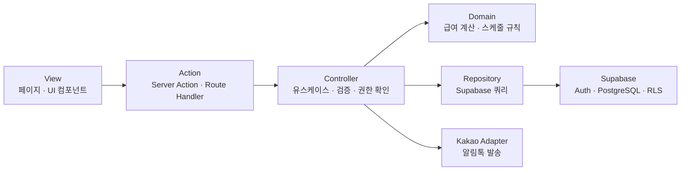

# 라비크루 아키텍처

## 기술 구성

- Next.js App Router + React 19 + TypeScript
- vanilla-extract
- Supabase Auth, PostgreSQL, Row Level Security(RLS)
- 카카오 알림톡 API

## VAC 구조

기능 단위로 View, Action, Controller를 함께 배치한다. View는 데이터를 직접 변경하지 않고 Action을 호출하며, Action은 Controller에 요청을 위임한다.



### 계층 책임

| 계층 | 책임 | 금지 사항 |
| --- | --- | --- |
| View | 화면 표시, 입력, 로컬 UI 상태 | Supabase 쓰기 호출, 업무 규칙 구현 |
| Action | 입력 수신, 스키마 검증, Controller 호출, 화면 갱신 | DB 쿼리와 업무 규칙 혼합 |
| Controller | 유스케이스 조합, 역할 확인, 업무 규칙 실행 | UI 상태와 SQL 세부 구현 |
| Domain | 급여 계산, 마감·배정 규칙 같은 순수 로직 | 외부 API, DB 접근 |
| Repository | Supabase 데이터 조회·저장 | 권한 정책과 업무 규칙 판단 |
| Adapter | 카카오 알림톡 등 외부 API 연동 | 도메인 규칙 판단 |

## 폴더 구조

```text
app/
├─ (auth)/                 # 로그인 · 회원가입
├─ (worker)/               # 알바 전용 화면
├─ (admin)/admin/          # 관리자 전용 화면
└─ api/                    # 웹훅 · 외부 HTTP 엔드포인트

features/
├─ schedule/
│  ├─ views/
│  ├─ actions/
│  ├─ controllers/
│  ├─ repositories/
│  ├─ domain/
│  ├─ schemas/
│  └─ components/
├─ attendance/
├─ payroll/
├─ notice/
├─ worker-management/
└─ invitation/

shared/
├─ auth/
├─ supabase/
├─ ui/
└─ lib/
```

## 권한과 보안

- 알바와 관리자는 하나의 Next.js 앱을 사용한다. 인증 화면은 `/`, 알바 화면은 `/home`, 관리자 화면은 `/admin`에 둔다.
- Supabase Auth는 이메일·비밀번호와 이메일 확인을 담당한다. 휴대폰 번호는 로그인 식별자가 아니라 `public.profiles`의 업무 연락처로 분리한다.
- 서버 레이아웃과 Controller에서 역할을 확인한다.
- Supabase RLS는 최종 데이터 접근 권한을 강제한다.
- 브라우저에는 Supabase 익명 키만 사용한다.
- `service_role` 키와 카카오 API 키는 서버 환경 변수에서만 사용한다.
- 일정 마감, 출석 확정, 급여 마감처럼 여러 데이터가 함께 변하는 작업은 Postgres RPC로 원자 처리한다.

## 다이어그램 규칙

- 아키텍처, 데이터 관계, 사용자 흐름처럼 연결 관계를 표현할 때는 Mermaid를 우선 사용한다.
- 노드에는 역할과 책임을 짧게 함께 쓴다.
- 화살표는 데이터·요청·제어 흐름의 방향을 나타낸다.
- 동적 조작이나 실제 카드 배치가 필요한 경우에만 HTML 다이어그램을 사용한다.
