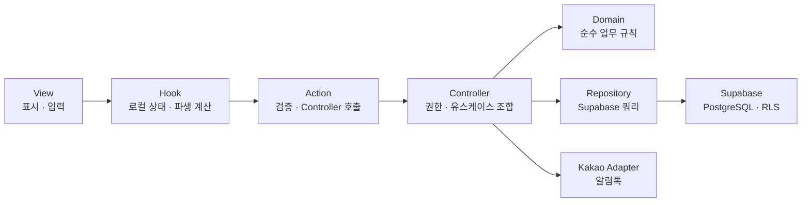

# 아키텍처 경계 구현 예시

이 문서는 `AGENTS.md`와 `docs/architecture.md`의 VAC 규칙을 코드로 적용할 때 참고하는 예시다. 규칙의 원본은 두 문서이며, 자동 검사는 대표적인 위반을 빠르게 감지하는 센서다.

## 허용되는 호출 방향



로컬 상태나 파생 계산이 없는 단순한 View는 Hook 없이 Action을 직접 호출해도 된다(`docs/decisions/013-view-hook-separation.md`).

## 권장 예시

```tsx
// app/(worker)/schedule/page.tsx
import { ScheduleView } from '@/features/schedule/views/schedule-view'

export default function SchedulePage() {
  return <ScheduleView />
}
```

```ts
// features/schedule/hooks/use-schedule-application-form.ts
'use client'

import { useState } from 'react'

import { applySchedule } from '@/features/schedule/actions/apply-schedule'

export function useScheduleApplicationForm() {
  const [isSubmitting, setIsSubmitting] = useState(false)

  async function submit(input: unknown) {
    setIsSubmitting(true)
    try {
      return await applySchedule(input)
    } finally {
      setIsSubmitting(false)
    }
  }

  return { isSubmitting, submit }
}
```

```ts
// features/schedule/actions/apply-schedule.ts
'use server'

import { applyScheduleController } from '@/features/schedule/controllers/apply-schedule-controller'
import { applyScheduleSchema } from '@/features/schedule/schemas/apply-schedule-schema'

export async function applySchedule(input: unknown) {
  const command = applyScheduleSchema.parse(input)
  return applyScheduleController(command)
}
```

## 금지 예시

```tsx
// app/(worker)/schedule/page.tsx
import { createClient } from '@/shared/supabase/server'

// 페이지가 Repository나 Supabase를 직접 호출하지 않는다.
```

```ts
// features/schedule/actions/apply-schedule.ts
import { saveApplication } from '@/features/schedule/repositories/schedule-repository'

// Action은 Repository를 직접 호출하지 않고 Controller를 경유한다.
```

```ts
// features/schedule/hooks/use-schedule-application-form.ts
import { saveApplication } from '@/features/schedule/repositories/schedule-repository'

// Hook도 View와 동일하게 Repository·Supabase를 직접 호출하지 않는다.
```

```ts
// shared/ui/button/button.tsx
import type { Schedule } from '@/features/schedule/domain/schedule'

// shared UI는 기능 도메인 타입을 알지 않는다.
```

## 자동 검사 범위

`npm run check:architecture`는 다음 대표 위반을 검사한다.

- `shared`에서 `app` 또는 `features`를 참조하는 import
- `app`에서 Supabase, Controller, Domain, Repository를 직접 참조하는 import
- Action에서 Domain, Repository, Supabase를 직접 참조하는 import
- 한 feature에서 다른 feature의 내부 파일을 직접 참조하는 import
- Client Component에서 서버 전용 모듈을 참조하는 import
- Domain에서 React, Next.js, Supabase, Hook 또는 다른 외부 VAC 계층을 참조하는 import

검사 스크립트는 TypeScript의 의미 전체를 증명하지 않는다. 검사를 통과하더라도 Controller의 서버 역할 확인과 Supabase RLS 검증은 별도로 수행한다.
