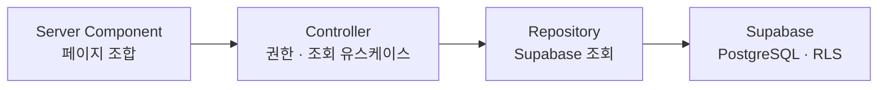
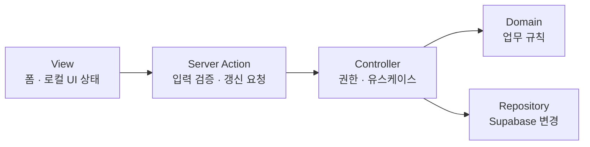

# Next.js 서버 경계 원칙

이 문서는 Supabase와 Server Action을 사용하는 기능에 적용할 호출 경계를 정한다. 인원 관리·내 프로필·초대 코드 기능부터 이 경계로 실제 서버 연결을 시작했으며, 이후 기능도 같은 방향을 따른다.

## 조회

- Server Component는 같은 앱의 Route Handler를 HTTP로 다시 호출하지 않는다.
- 조회는 Controller를 통해 Repository와 원본 데이터 소스로 직접 연결한다.
- 개인 일정·출석·급여는 서버에서 역할을 확인하고 RLS를 최종 경계로 둔다.

## 변경

- 사용자가 발생시키는 내부 변경은 Server Action을 기본 경계로 사용한다.
- Route Handler는 웹훅이나 외부 시스템이 호출할 HTTP 엔드포인트에만 사용한다.
- Action은 입력 검증, Controller 호출, 필요한 캐시 갱신만 담당한다.
- Client Component는 Server Action의 공개 입력 타입만 알고 Controller·Repository·Supabase 서버 모듈을 import하지 않는다.

## 클라이언트 경계

- Server Component를 기본으로 유지한다.
- 달력 선택, 탭 전환, 모달처럼 브라우저 상태가 필요한 가장 작은 컴포넌트에만 `'use client'`를 선언한다.
- 서버에서 받은 값은 직렬화 가능한 props로 View에 전달한다.
