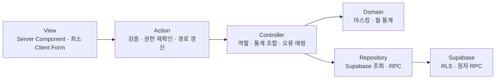

# ADR 006: 인원·프로필·초대 코드 실제 데이터 연결

- 상태: 승인
- 결정일: 2026-07-24

## RADIO

### Requirements and resilience

- 관리자는 실제 구성원의 마스킹된 이메일·연락처, 개인 시급, 근속, 가능한 포지션, 월 평균 신청 일수와 지난달 출근·포지션 이력을 조회한다.
- 마스킹된 연락처는 관리자 수정 폼에 다시 전송하지 않는다. 관리자 수정은 이름·시급·가능 포지션만 허용한다.
- 단일 관리자는 비활성화할 수 없고 알바와 본인의 탈퇴는 물리 삭제 대신 `is_active = false`로 보존한다.
- 초대 코드 생성은 중복 가능성을 낮춘 서버 난수 코드를 사용하며 생성 직후 Action 결과와 관리자 목록에서 확인한다.
- 초대 코드는 저장된 활성 여부뿐 아니라 만료 시각과 사용 횟수를 함께 판단해 사용 중·만료·사용 완료·사용 중지 상태로 표시한다.
- 서버 조회 중에는 로딩 상태를, 조회 실패 시에는 다시 시도할 수 있는 오류 경계를 제공한다.

### Architecture

- 조회 원본은 Supabase이고 서버 컴포넌트가 Controller 결과를 직렬화 가능한 ViewModel로 전달한다.
- 변경 Action과 Controller가 각각 역할을 확인하고 RLS/RPC가 최종 권한을 강제한다. 초대 코드 생성·중지는 요청 ID를 받는 관리자 전용 멱등 RPC만 사용한다.
- 회원 정보와 가능한 포지션은 `admin_update_worker_profile`에서 한 트랜잭션으로 변경한다.

### Data model

- `profiles.email`은 `auth.users.email`의 조회용 사본이며 Auth 변경 트리거가 동기화한다.
- `invite_codes.label`은 관리자가 코드의 목적을 구분하는 1~60자 설명이다.
- 신청 평균은 `applied` 상태의 고유 근무일을 월별로 집계한 뒤 신청 기록이 있는 월들의 평균으로 계산한다.
- 지난달 출근·포지션 횟수는 이전 달의 `present` 출석만 집계한다.

### Interfaces

- 모든 Server Action은 `{ ok, code?, message }` 형태를 반환한다.
- 관리자 회원 수정은 `name`, `hourlyWage`, `positionIds[]`만 받는다.
- 본인 수정은 `name`, `phone`, `kakaoConsent`만 받으며 시급·역할·활성 상태는 입력 계약에 포함하지 않는다.

### Optimization and observability

- 목록 조회는 프로필·스킬·신청·배정/출석을 병렬 조회하고 Controller에서 한 번 조합한다. 단일 인원 상세는 해당 인원의 신청·배정 이력만 조회한다.
- 변경 후 실제 영향을 받는 `/admin/workers`, 상세 경로, `/admin/invites`, `/profile`, `/home`만 갱신한다.
- 마스킹, 신청 평균, 이전 달 출석 집계와 입력 파서를 순수 테스트로 검증한다.

## 접근 행렬

| 작업 | 익명 | 알바 | 관리자 | 최종 경계 |
| --- | --- | --- | --- | --- |
| 본인 프로필 조회·수정·비활성화 | 거부 | 본인만 | 관리자 화면과 분리 | RLS + 본인 RPC |
| 전체 인원·통계 조회 | 거부 | 거부 | 허용 | RLS + Controller |
| 이름·시급·가능 포지션 동시 수정 | 거부 | 거부 | 허용 | 관리자 RPC |
| 회원 비활성화 | 거부 | 본인 알바만 | 알바 대상만 | 역할별 RPC |
| 초대 코드 조회·생성·중지 | 거부 | 거부 | 허용 | 조회 RLS + 변경 RPC |

## 운영 주의

- 마이그레이션 적용 후 원격 프로젝트에서 TypeScript 타입을 다시 생성한다.
- 생성된 Supabase 타입은 원격 스키마 변경 뒤 다시 동기화한다. nullable PL/pgSQL 입력은 생성 타입이 실제 함수 기본값을 표현하는지 별도로 확인한다.
- 원격 적용 후 Security/Performance Advisor와 관리자·알바·비활성 계정의 허용/거부 사례를 확인한다.
