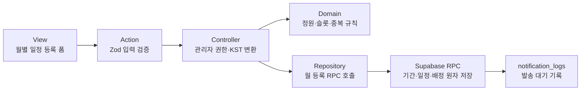

# 관리자 월별 일정 등록 설계

## 결정

관리자는 한 달의 미등록 주말 중 필요한 날짜를 활성화해 일정과 배정을 작성한다. `최종 저장`을
누르면 대상 월의 신청 기간, 모든 활성 일정, 배정, 출석 대기 행과 알림 발송 대기 행을 하나의
Postgres RPC에서 원자 저장한다. 성공 즉시 일정은 `published`, 배정은 `confirmed`가 되며 별도의
초안 저장이나 후속 확정 단계는 제공하지 않는다.

카카오 알림톡 API 연동은 이번 범위에서 제외한다. 대신 카카오 수신에 동의한 배정자마다
`notification_logs.delivery_status = 'pending'` 행을 생성한다.

## RADIO

### R — Requirements and resilience

- 활성 관리자만 월별 일정 등록을 조회하고 저장할 수 있다.
- 관리자 일정 첫 화면의 달력은 조회 전용이며 URL의 `month=YYYY-MM`을 표시 월의 기준으로 삼는다.
- 등록 화면은 실제 DB의 월 신청 기간, 등록 일정, 미등록 주말과 활성 구성원 데이터를 표시한다.
- 날짜별 설정을 활성화한 미등록 주말만 저장 대상으로 삼는다.
- 각 활성 날짜는 예식 개수, 같은 날 안의 시작·종료 시각과 고정 8개 포지션의 배정을 가져야 한다.
- 예식 개수는 1 이상의 정수이고 종료 시각은 시작 시각보다 늦어야 한다.
- 마감 시각은 한국 시간(`Asia/Seoul`) 기준으로 입력·표시하고 `timestamptz`로 저장한다.
- 관리자는 미신청 구성원과 관리자 본인을 배정할 수 있지만 비활성 구성원은 배정할 수 없다.
- 가능한 포지션은 참고 정보이며 배정을 강제로 제한하지 않는다.
- 한 구성원은 같은 날짜에 한 포지션에만 배정할 수 있다.
- 제출 중 중복 실행을 막고 같은 요청의 재시도는 중복 일정·배정·알림을 만들지 않는다.
- 한 항목이라도 실패하면 해당 월 요청 전체를 rollback하고 성공 메시지를 표시하지 않는다.
- 저장 실패 시 폼 입력을 보존하고 오류가 있는 날짜·포지션·슬롯을 구체적으로 안내한다.
- 잘못된 월·날짜는 하드코딩된 다른 날짜로 대체하지 않고 명시적으로 거부하거나 canonical URL로
  이동한다.

#### 배정 정원

| 포지션 | 기본 슬롯 | 교육 추가 슬롯 | 최대 인원 |
| --- | ---: | ---: | ---: |
| 매니저·안내 | 2 | 1 | 3 |
| 팀장·스캔·메인·드레스·축가·대기실 | 1 | 1 | 2 |

- 기본 슬롯은 모두 채워야 하고 삭제할 수 없다.
- 기본 슬롯의 배정은 교육 여부를 선택할 수 있다.
- 포지션별 교육 추가 슬롯은 최대 한 개만 만들 수 있다.
- 추가 슬롯은 생성 시부터 `isTraining = true`로 고정하며 교육 상태를 해제할 수 없다.
- X 삭제 버튼은 추가 교육 슬롯에만 표시한다.

### A — Architecture and data flow



- Server Component가 월 신청 기간, 등록 일정, 미등록 주말과 배정 후보 view model을 조회한다.
- Client Component는 서버 상태를 복제하지 않고 아직 저장하지 않은 편집 draft만 관리한다.
- Action은 JSON 폼 입력을 `unknown`으로 받고 Zod로 검증한 뒤 Controller를 호출한다.
- Controller는 활성 관리자 역할을 다시 확인하고 한국 시간 변환과 오류 매핑을 담당한다.
- Domain은 DB에 의존하지 않는 배정 정원, 슬롯과 중복 규칙을 검증한다.
- Repository는 조회 쿼리와 월 등록 RPC 호출만 담당한다.
- RPC는 함수 내부에서 활성 관리자, 업무 제약과 동시성을 다시 검증한다.
- 성공 후 `/admin/schedules`, `/admin/schedules/new`와 생성된 날짜 상세 경로를 재검증하고 해당
  월 일정 목록으로 이동한다.

### D — Data model

#### View model

```ts
type MonthRegistrationViewModel = {
  month: string
  period: {
    id: string | null
    status: 'open' | 'closed'
    applicationDeadline: string | null
    updatedAt: string | null
  }
  registeredSchedules: RegisteredScheduleSummary[]
  unregisteredWeekendDates: string[]
  workers: AssignmentWorkerOption[]
}
```

배정 후보에는 ID, 이름, 역할, 해당 날짜 신청 여부, 가능한 포지션, 지난달 출근 횟수와 포지션별
수행 횟수를 포함한다. 비활성 구성원은 포함하지 않는다.

#### Form input

```ts
type PublishMonthlySchedulesInput = {
  requestId: string
  month: string
  expectedPeriodUpdatedAt: string | null
  applicationDeadlineDate: string
  applicationDeadlineTime: string
  schedules: Array<{
    workDate: string
    ceremonyCount: number
    startTime: string
    endTime: string
    assignments: Array<{
      workerId: string
      positionId: PositionId
      slotIndex: number
      slotKind: 'base' | 'extra-training'
      isTraining: boolean
    }>
  }>
}
```

`requestId`는 확인 단계가 열릴 때 한 번 생성하고 같은 제출의 재시도 동안 유지한다.

#### Persistence

- `shift_assignments.slot_index`를 추가하고 활성 배정의
  `(shift_id, position_id, slot_index)`를 고유하게 만든다.
- `private.schedule_registration_requests`에 요청자, 대상 월, payload hash와 완료 결과를 저장해
  멱등성을 보장한다. 이 테이블은 Data API 역할에 노출하지 않는다.
- `notification_logs.correlation_id`로 월 등록 요청과 알림 대기 행을 연결한다.
- 최초 확정 알림은 `(assignment_id, type, channel)` 기준으로 중복 생성하지 않는다.
- 시급 스냅샷은 입력에서 받지 않고 RPC가 배정 대상 프로필의 현재 개인 시급을 복사한다.
- 일정은 `published`, 배정은 `confirmed`, `confirmed_at = now()`로 생성한다.
- 기존 배정 생성 trigger와 정합되게 배정별 `attendance_records.status = 'pending'` 행을 만든다.

### I — Interfaces and integration contracts

#### RPC

```sql
public.save_monthly_schedule_registration(
  p_request_id uuid,
  p_year_month date,
  p_application_deadline timestamptz,
  p_expected_period_updated_at timestamptz,
  p_schedules jsonb
) returns jsonb
```

RPC는 다음을 검증한다.

1. 호출자가 활성 관리자다.
2. 대상 월은 월의 첫날이며 요청 날짜가 같은 달의 토·일요일이다.
3. 요청 날짜가 중복되지 않고 기존 일정이 없는 날짜다.
4. 예식 개수와 근무시간이 유효하다.
5. 각 날짜에 고정 8개 포지션이 정확히 한 그룹씩 존재한다.
6. 기본 슬롯이 연속해서 모두 존재한다.
7. 추가 슬롯은 포지션별 최대 하나이며 반드시 교육 배정이다.
8. 배정 대상이 활성 상태이고 시급이 양수다.
9. 한 구성원이 같은 날짜에 중복 배정되지 않는다.
10. 신청 기간의 `updated_at`이 예상 값과 일치한다.

RPC는 같은 `requestId`와 같은 payload의 완료 결과를 그대로 반환하고, 같은 `requestId`를 다른
payload에 재사용하면 거부한다. 동일 월 저장은 신청 기간 행을 잠그고 날짜 오름차순으로 처리한다.

RPC는 `SECURITY DEFINER SET search_path = ''`를 사용하고 모든 객체를 스키마로 완전 수식한다.
`PUBLIC`과 `anon`의 실행 권한을 철회하고 `authenticated`에만 실행을 허용하되 함수 첫 단계에서
활성 관리자를 다시 확인한다.

관리자도 신청 기간·일정·배정·알림 테이블에 직접 쓰지 못하게 기존 직접 DML 권한과 쓰기 정책을
제거한다. 조회 정책과 알바의 본인 신청 경계는 유지한다.

#### Result

```ts
type PublishMonthlySchedulesResult = {
  requestId: string
  periodId: string
  periodUpdatedAt: string
  publishedScheduleCount: number
  confirmedAssignmentCount: number
  pendingNotificationCount: number
}
```

#### Error contract

- `INVALID_INPUT`
- `FORBIDDEN`
- `STALE_PERIOD`
- `DATE_ALREADY_REGISTERED`
- `INVALID_CAPACITY`
- `EXTRA_SLOT_MUST_BE_TRAINING`
- `DUPLICATE_WORKER`
- `WORKER_INACTIVE`
- `WAGE_NOT_CONFIGURED`
- `IDEMPOTENCY_KEY_REUSED`
- `SAVE_FAILED`

알려진 오류만 `FormActionResult`의 안전한 한국어 메시지로 변환하고 SQL, 제약조건명, 개인정보와
원본 DB 오류는 반환하지 않는다. 필드 오류 키는
`dates.<date>.positions.<position>.slots.<slot>.workerId`처럼 안정적인 경로를 사용한다.

### O — Optimization and observability

- 월 저장은 RPC 한 번으로 처리한다.
- 날짜 편집기를 독립 컴포넌트로 분리해 한 슬롯 변경이 다른 날짜 전체를 불필요하게 갱신하지 않게
  한다.
- 제출 중 `aria-busy`, 버튼 비활성화와 고정된 버튼 폭으로 중복 제출과 CLS를 방지한다.
- 개인정보, 시급과 코드 원문은 로그에 남기지 않고 요청 상관 ID와 안전한 결과 수치만 사용한다.
- 일정 수, 배정 수, pending 알림 수를 성공 결과로 확인한다.
- 이후 카카오 Adapter는 pending 로그를 처리하고 성공·실패 상태를 갱신하는 별도 작업으로 추가한다.

## 화면 동작

- 등록 일정은 기존 `RegisteredScheduleCard`를 읽기 전용으로 재사용한다.
- 미등록 주말은 기본 비활성 상태이며 `일정 설정`으로 편집기를 연다.
- 입력한 날짜 설정을 취소하거나 dirty 상태에서 페이지를 벗어나면 입력 유실 확인을 제공한다.
- 포지션 액션은 `교육 인원 추가`로 표시하고 추가 슬롯에는 교육 고정 배지를 표시한다.
- 같은 날짜의 다른 슬롯에 선택한 구성원은 선택지에서 비활성화하지만 서버도 중복을 거부한다.
- 최종 저장 전 확인 영역에 날짜 수, 총 배정 수와 교육 인원 수를 표시한다.
- 최종 확인 버튼은 `N일 일정 등록·배정 확정`으로 표시한다.
- 성공 메시지는 실제 카카오 발송을 주장하지 않고
  `N일 일정과 M명 배정을 확정했습니다. 알림 K건을 발송 대기로 기록했습니다.`로 표시한다.
- stale 또는 기존 일정 충돌 시 입력을 보존하고 최신 상태를 다시 불러오는 동작을 제공한다.

## 접근성과 반응형

- 폼, 날짜별 section, 포지션별 fieldset·legend를 사용한다.
- 모든 select label에 날짜, 포지션과 슬롯 순서를 포함한다.
- 이력과 오류를 `aria-describedby`, 오류 상태를 `aria-invalid`로 연결한다.
- 오류 요약은 `role="alert"`, 추가·삭제·성공 상태는 `aria-live="polite"`로 알린다.
- 확인 영역이 열리면 제목으로 focus를 옮기고 취소하면 원래 저장 버튼으로 돌려보낸다.
- `34rem` 이하에서는 포지션별 세로 카드를 유지하고 페이지 가로 스크롤을 만들지 않는다.
- select는 남은 폭을 사용하고 X 버튼은 최소 44px 터치 영역을 유지한다.
- 긴 이름과 이력은 별도 줄에서 줄바꿈하고 하단 내비게이션과 safe area가 최종 액션을 가리지 않는다.

## 문서 변경

- 요구사항, 사용자 흐름과 화면 구조의 `포지션별 1~3명`을 `기본 정원 + 교육 추가 슬롯 1개`로
  교체한다.
- 월 최종 저장이 즉시 `published/confirmed`이며 별도 draft 단계가 없음을 명시한다.
- 사용자 흐름의 `카카오 알림톡 발송`은 이번 범위에서 `알림 발송 대기 로그 생성`으로 수정한다.
- 아키텍처와 ADR 005의 허용 RPC 목록에 월 원자 등록 RPC와 직접 DML 차단 경계를 추가한다.
- ERD에 `slot_index`, 멱등 요청 저장소, correlation ID와 RPC 관계를 반영한다.

## 검증

- Domain/Zod: 월·주말·예식·시간, 8개 포지션, 기본 슬롯, 교육 추가 슬롯, 중복 인원 경계값.
- RPC: anon·worker·비활성 관리자 거부, 활성 관리자 성공, 위조 시급·관리자 값 무시/거부.
- 원자성: 마지막 배정이나 알림 생성 실패 시 기간·일정·배정·출석·알림·요청 전체 rollback.
- 멱등성: 동일 요청 재시도는 같은 결과이며 다른 payload 재사용은 거부.
- RLS/GRANT: 관리자도 RPC 밖의 운영 테이블 직접 쓰기가 불가능하고 기존 worker 조회·신청은 유지.
- 상태: 저장 직후 일정 published, 배정 confirmed, 출석 pending, 동의자 알림 pending.
- UI: 설정·취소, 교육 슬롯 추가·삭제, 오류 focus, pending 중복 제출 차단, 성공 후 실제 DB 재조회.
- 모바일: `34rem` 이하에서 긴 이름·이력, 확대 글꼴, safe area와 가로 overflow를 확인한다.
- 저장소 검사: format, lint, type, architecture, harness, 관련 test와 production build.
- DB 검사: migration 적용 전후 허용·거부 SQL, 원자성, Security/Performance Advisor.

## 제외 범위

- 카카오 알림톡 실제 API 호출, 재시도 worker와 provider 결과 갱신
- 기존 일별 일정의 수정·취소 구현
- 알바의 일정 신청·취소 실제 데이터 연결
- 출석 확정과 급여 계산
