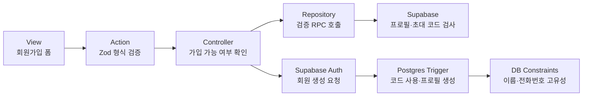

# 회원가입 식별 정보 검증 설계

## 결정

라비에벨 구성원 범위에서는 동명이인을 허용하지 않는다. 회원가입 시 이름과 휴대폰 번호는 각각
고유해야 하며, 라비에벨 전용 코드는 `public.invite_codes`에 저장된 실제 코드의 활성 상태, 만료
시각, 사용 가능 횟수까지 확인해야 한다.

## RADIO

### R — Requirements and resilience

- 사용자는 회원가입 화면에서 이름, 이메일, 휴대폰 번호, 비밀번호, 라비에벨 전용 코드를
  제출한다.
- 이름이나 휴대폰 번호가 이미 등록됐다면 해당 입력란에 각각
  `이미 등록된 이름입니다.`, `이미 등록된 휴대폰 번호입니다.`를 표시한다.
- 전용 코드가 존재하지 않거나 비활성·만료·소진 상태라면 코드 입력란에
  `라비에벨 전용 코드가 올바르지 않습니다.`를 표시한다.
- 실패한 필드의 입력값만 지우고 나머지 입력값과 체크 상태는 유지한다.
- 실제 전용 코드, 전체 프로필 목록, 원본 Postgres/Auth 오류는 브라우저나 로그에 노출하지 않는다.
- 중복 검사와 실제 가입 사이에 다른 요청이 먼저 처리되는 경쟁 상태에서도 DB 고유 제약과 가입
  트리거가 잘못된 데이터를 거부해야 한다.

### A — Architecture and data flow

1. Action이 Zod로 입력 형식과 필수값을 검증한다.
2. Controller가 Repository를 통해 회원가입 전용 검증 RPC를 호출한다.
3. RPC는 이름 중복, 전화번호 중복, 초대 코드 사용 가능 여부를 서버 내부에서 확인하고 제한된
   상태 코드만 반환한다.
4. 실패 상태는 공통 `FormActionResult.fieldErrors`로 변환한다. 이때 문제가 있는 필드만 지정한다.
5. 모든 검사를 통과하면 기존 Supabase Auth `signUp`을 호출한다.
6. 가입 트리거는 초대 코드를 다시 확인하고 원자적으로 사용 횟수를 올린 뒤 프로필을 생성한다.
7. 이름·전화번호 고유 인덱스가 사전 검사 이후의 경쟁 상태를 최종 차단한다.

클라이언트 검사는 안내를 빠르게 제공하기 위한 보조 수단일 뿐이며 보안 경계로 사용하지 않는다.

### D — Data model

- `profiles.name`: 앞뒤 공백을 제거한 값을 저장하며 대소문자를 구분하지 않는 고유 인덱스를 둔다.
- `profiles.phone`: 숫자만 저장하며 기존 고유 제약을 유지한다.
- `invite_codes.code`: 실제 코드 원본이며 클라이언트로 반환하지 않는다.
- 가입 가능 여부 결과는 행 데이터 대신 다음 세 boolean만 가진 고정 DTO로 표현한다.
  - `is_name_available`
  - `is_phone_available`
  - `is_invite_code_valid`

초대 코드가 없는 경우와 비활성·만료·소진된 경우는 모두 `is_invite_code_valid = false`로 처리한다.
기존 프로필에 정규화 후 같은 이름이 둘 이상 존재하면 마이그레이션은 임의 병합 없이 중단한다.

### I — Interfaces and integration contracts

- Repository 입력: 정규화된 `name`, `phone`, `inviteCode`
- Repository 출력: 이름·전화번호·초대 코드의 유효 여부만 담은 고정 DTO
- Controller 출력:
  - 이름 중복 → `fieldErrors.name`
  - 전화번호 중복 → `fieldErrors.phone`
  - 둘 다 중복 → 두 필드 오류
  - 코드 오류 → `fieldErrors.inviteCode`
- RPC에는 `anon` 실행 권한을 필요한 함수 하나에만 부여한다. 함수는 `security definer`와 빈
  `search_path`를 사용하며 행 데이터나 실제 코드를 반환하지 않는다.
- 여러 항목이 동시에 실패하면 해당하는 모든 필드 오류를 한 응답에 함께 반환한다.
- Auth 가입 과정에서 발생한 고유 제약·초대 코드 경쟁 실패도 같은 필드 오류 계약으로 매핑한다.

### O — Optimization and observability

- 가입 전 검증은 단일 RPC 왕복으로 처리한다.
- RPC는 이름·전화번호 고유 인덱스와 초대 코드 고유 인덱스를 사용한다.
- 검증 상태와 사용자용 메시지만 반환하고 개인정보·코드·비밀번호는 기록하지 않는다.
- Zod 형식 검증, 상태별 오류 매핑, DB 함수의 허용·거부 사례를 테스트한다.
- 전체 정적 검사, 단위 테스트, 프로덕션 빌드와 Supabase 보안 advisor 결과를 확인한다.

## 오류 복구

- 형식 오류는 외부 요청 전에 반환한다.
- 중복 또는 코드 오류는 해당 입력값만 비우고 사용자가 나머지 정보를 다시 입력하지 않도록 한다.
- 가입 전 검사 통과 후 경쟁 요청 때문에 실패한 경우에도 성공으로 표시하지 않으며, 충돌한 필드에
  동일한 오류를 표시한다.
- 일시적인 DB/Auth 장애는 필드 오류로 오인하지 않고 재시도 가능한 일반 가입 실패로 표시한다.

## 범위

이번 변경은 이메일 고유성 정책과 관리자 초대 코드 관리 UI를 변경하지 않는다. MVP 인증 수단은
이메일·비밀번호와 이메일 확인으로 한정하며 OAuth 온보딩 경로와 관련 공개 RPC는 제거한다.
