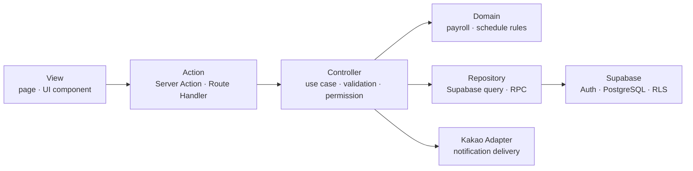

# Lavi Crew MVP completion design

## Scope and fixed product decisions

This document closes the remaining gaps between the approved product plan and the
application. The implementation order is:

1. monthly worker applications,
2. monthly publishing and daily schedule maintenance,
3. attendance and confirmed payroll,
4. notices and real dashboards,
5. Kakao notification delivery,
6. end-to-end verification and documentation alignment.

The following decisions remove ambiguity without changing the approved flow:

- A worker applies to a `work_date` inside a monthly application period. An
  application does not depend on a published shift.
- A worker saves all selected dates for one month atomically. Until the period
  closes, the worker may cancel and re-apply to the same date.
- The administrator opens a month by setting its deadline. The month closes
  automatically at the deadline or manually, and may be reopened only before
  schedules are published.
- Publishing remains a single atomic operation and immediately confirms shifts
  and assignments.
- Once any attendance for a shift is confirmed, structural schedule edits and
  schedule cancellation are blocked. Attendance corrections use the existing
  reason-required correction path.
- A payroll week is Monday through Sunday in Asia/Seoul. Monthly average payroll
  includes only months that contain at least one active, confirmed payroll
  detail. Each calculated detail is rounded to the nearest won.
- A notice becomes read when the worker opens its content. Deletion is soft
  deletion and pinned notices sort first.
- Kakao consent remains required for this members-only MVP. Email/password is
  the authentication method; Kakao OAuth is not part of the MVP.
- Notification delivery claims queued rows atomically, retries transient
  failures at most three times with backoff, and stores provider IDs and
  user-safe failure details. Provider credentials remain server-only.

## RADIO

### R — Requirements and resilience

- Worker goal: choose weekend dates for one month and safely change them until
  the month closes.
- Administrator goal: see applicants, publish a complete roster, maintain each
  day, confirm attendance, manage notices and people, and see delivery state.
- Worker goal after work: see only confirmed attendance-based weekly/monthly
  payroll and paid-month average.
- Entry points remain the existing role-separated routes and mobile bottom
  navigation.
- All mutations prevent duplicate submission, validate with Zod at the
  application boundary and again enforce permission/state transitions in
  Postgres.
- Loading, empty, validation, stale conflict, forbidden, not-found, server-error
  and retry states are explicit. Destructive actions require confirmation.
- Asia/Seoul is the business timezone. Mobile layouts work from 320px without
  horizontal document overflow; touch targets are at least 44px.

### A — Architecture and data flow

- Server components own initial server state. URL query parameters own selected
  months/dates. Client components own only draft/form interaction state.
- Mutations return the shared `FormActionResult`, revalidate the smallest
  affected route set, and use idempotency keys for multi-row operations.
- Public tables keep RLS enabled. Multi-table business mutations are
  authenticated RPCs with explicit role and active-profile checks.
- No service-role key is exposed to the browser.

### D — Data model

- `schedule_application_periods`: one row per month, deadline and open/closed
  state.
- `schedule_applications`: period, worker and work date with
  `applied/cancelled`; one logical row per worker/date and an update transition
  supports re-application.
- `shifts`: a published work date and event/time information.
- `shift_assignments`: position, slot, worker and hourly-wage snapshot.
- `attendance_records`: pending/present/absent and actual timestamps.
- `payroll_items` and `monthly_payrolls`: immutable calculation history and
  current aggregates.
- `notices` and `notice_reads`: soft-deleted content and idempotent per-worker
  reads.
- `notification_logs`: event, recipient, payload, delivery state, attempts,
  next-attempt time, provider ID and failure information.

Transport DTOs stay in repositories, domain types in domain modules and page
view models in schemas. No UI imports raw Supabase generated row types.

### I — Interfaces and integration contracts

- Application save input: month, selected weekend dates, expected period
  version and request ID.
- Schedule daily mutation input: shift ID, expected updated timestamp, event
  count, start/end time, complete assignments and request ID.
- Schedule cancellation input: shift ID, expected updated timestamp, reason and
  request ID.
- Attendance input follows the existing RPC contract and requires correction
  reason after first confirmation.
- Notification provider returns provider message ID or a classified
  transient/permanent error. Logs never store API keys or raw provider
  responses containing secrets.
- Every server action maps database/provider errors to stable machine codes and
  Korean user-safe messages.

### O — Optimization and observability

- Month/date queries select only page fields and use indexed month, worker,
  date, status and delivery-state columns.
- Server rendering is the default; client JavaScript is restricted to
  interactive forms and filters.
- Revalidation targets only affected schedule, home, payroll, notice or admin
  routes.
- Automated tests cover domain transitions, Zod boundaries, repository error
  mapping and local-database RLS/RPC authorization. Critical authenticated
  browser journeys remain a separate release check.
- Release checks require formatting, lint, architecture, harness, unit tests,
  production build and DB E2E. Supabase security/performance advisors and
  mobile browser smoke tests must be recorded separately before release.

## Acceptance boundary

The MVP is complete when fixture data is absent from user-facing business
screens, refresh preserves every successful mutation, worker/admin permissions
are enforced in the database, schedule-to-payroll state transitions pass
end-to-end tests, and Kakao delivery code is operational. A live Kakao send can
only be certified after provider endpoint, approved template and credentials
are supplied.
